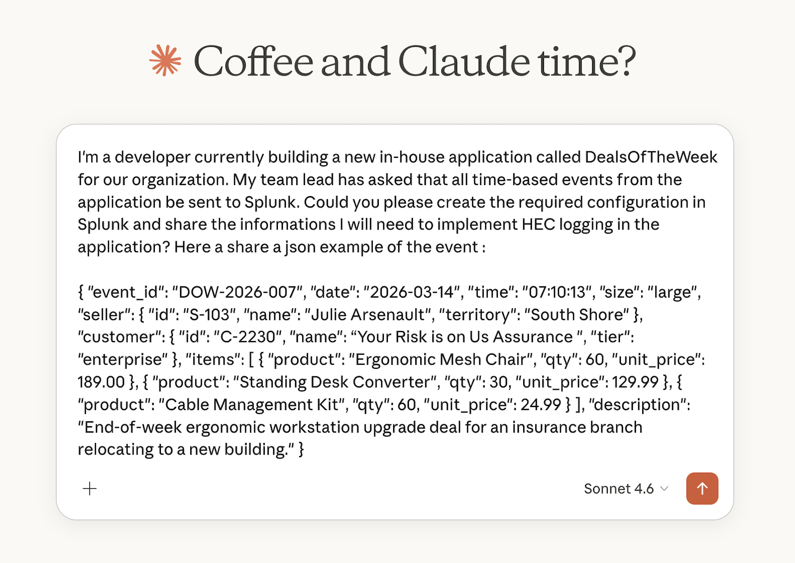

# Splunk Configuration MCP Server

A [Model Context Protocol (MCP)](https://modelcontextprotocol.io/) server that enables Claude Desktop to interact directly with your Splunk instance for configuration management. Manage indexes, saved searches, dashboards, HEC tokens, users, macros, field extractions, and more — all from a natural language conversation with Claude.

---



---

## Table of Contents

- [Features](#features)
- [Prerequisites](#prerequisites)
- [Installation](#installation)
  - [macOS](#macos)
  - [Windows](#windows)
- [Splunk Configuration](#splunk-configuration)
  - [Generating an Authentication Token (Recommended)](#generating-an-authentication-token-recommended)
  - [RBAC: Creating a Least-Privilege Role for the MCP Token](#rbac-creating-a-least-privilege-role-for-the-mcp-token)
  - [Enabling the REST API Port](#enabling-the-rest-api-port)
- [Available Tools](#available-tools)
- [How It Works](#how-it-works)
- [Usage Examples](#usage-examples)
- [Security Notes](#security-notes)

---

## Features

| Category | Tools |
|---|---|
| **Index Management** | List, create, update, delete indexes |
| **Saved Searches** | List, create, update, delete saved searches & reports |
| **Dashboards** | List, get, create, update, delete Classic XML and Dashboard Studio dashboards |
| **HEC Tokens** | List, create, delete HTTP Event Collector tokens |
| **Lookup Tables** | List and upload CSV lookup files |
| **Users & Roles** | List users, create users, list roles |
| **Apps** | List installed apps, get app details |
| **Macros** | List and create SPL search macros |
| **Field Extractions** | List props.conf field extractions |
| **Alert Actions** | List configured alert actions |
| **System Info** | Get Splunk server info and health |
| **Config Export** | Export app configuration (searches, dashboards, lookups) as JSON |

---

## Prerequisites

- Python 3.10 or higher
- [Claude Desktop](https://claude.ai/download) installed
- A running Splunk instance (on-premises accessible via network, or Cloud)
- Splunk REST API access on port `8089` (default)

---

## Installation

### macOS

**1. Clone the repository**

```bash
git clone https://github.com/tekgourou/Splunk_config_mcp_server.git
cd Splunk_config_mcp_server
```

**2. Create a virtual environment and install dependencies**

```bash
python3 -m venv venv
source venv/bin/activate
pip install mcp httpx pydantic
```

**3. Note the full path to your Python interpreter**

```bash
which python3
# Example output: /Users/yourname/Splunk_config_mcp_server/venv/bin/python3
```

**4. Configure Claude Desktop**

Open the Claude Desktop configuration file:

```bash
open ~/Library/Application\ Support/Claude/claude_desktop_config.json
```

Add the following block inside the `mcpServers` object (create the file if it doesn't exist):

```json
{
  "mcpServers": {
    "splunk-config": {
      "command": "/Users/yourname/Splunk_config_mcp_server/venv/bin/python3",
      "args": ["/Users/yourname/Splunk_config_mcp_server/server.py"],
      "env": {
        "SPLUNK_HOST": "your-splunk-host",
        "SPLUNK_PORT": "8089",
        "SPLUNK_TOKEN": "your-splunk-token",
        "SPLUNK_SCHEME": "https",
        "SPLUNK_VERIFY_SSL": "false"
      }
    }
  }
}
```

> Replace the paths, host, and token with your actual values.

**5. Restart Claude Desktop**

Quit and reopen Claude Desktop. You should see the Splunk tools available in the tools panel (hammer icon).

---

### Windows

**1. Clone the repository**

```powershell
git clone https://github.com/tekgourou/Splunk_config_mcp_server.git
cd Splunk_config_mcp_server
```

**2. Create a virtual environment and install dependencies**

```powershell
python -m venv venv
.\venv\Scripts\activate
pip install mcp httpx pydantic
```

**3. Note the full path to your Python interpreter**

```powershell
where python
# Example output: C:\Users\yourname\Splunk_config_mcp_server\venv\Scripts\python.exe
```

**4. Configure Claude Desktop**

Open the Claude Desktop configuration file. It is located at:

```
%APPDATA%\Claude\claude_desktop_config.json
```

You can open it directly from PowerShell:

```powershell
notepad "$env:APPDATA\Claude\claude_desktop_config.json"
```

Add the following block (create the file if it doesn't exist):

```json
{
  "mcpServers": {
    "splunk-config": {
      "command": "C:\\Users\\yourname\\Splunk_config_mcp_server\\venv\\Scripts\\python.exe",
      "args": ["C:\\Users\\yourname\\Splunk_config_mcp_server\\server.py"],
      "env": {
        "SPLUNK_HOST": "your-splunk-host",
        "SPLUNK_PORT": "8089",
        "SPLUNK_TOKEN": "your-splunk-token",
        "SPLUNK_SCHEME": "https",
        "SPLUNK_VERIFY_SSL": "false"
      }
    }
  }
}
```

> **Important:** Use double backslashes (`\\`) in Windows paths inside JSON.

**5. Restart Claude Desktop**

Close and reopen Claude Desktop. The Splunk tools will appear in the tools panel.

---

## Splunk Configuration

### Generating an Authentication Token (Recommended)

Token-based authentication is strongly preferred over username/password. Here's how to generate one using the Splunk Web GUI:

1. Log in to your Splunk instance (e.g., `https://your-splunk-host:8000`)
2. Click your **username** in the top-right corner → **Account Settings**
3. Scroll down to the **Authentication Tokens** section
4. Click **Generate New Token**
5. Fill in the fields:
   - **Audience:** `claude-mcp` (or any label you prefer)
   - **Expiration:** Set an appropriate expiry (or leave blank for no expiry)
6. Click **Generate**
7. **Copy the token immediately** — it will not be shown again
8. Paste the token as the value for `SPLUNK_TOKEN` in your `claude_desktop_config.json`

> **Minimum permissions required:** The Splunk account used for the token should have the `admin` role, or at minimum a custom role with `edit_*` capabilities for the resources you want to manage.

---

### RBAC: Creating a Least-Privilege Role for the MCP Token

Instead of using a full `admin` account, it is strongly recommended to create a **dedicated service account** with a **custom role** scoped to only the capabilities the MCP server actually needs. This limits the blast radius if the token is ever compromised.

#### Step 1 — Create a custom role

1. Log in to Splunk Web and go to **Settings** → **Access Controls** → **Roles**
2. Click **New Role**
3. Set the **Role Name** to something descriptive, e.g. `mcp_config_role`
4. Under **Inheritance**, add `user` as a base role (provides baseline search capabilities)
5. Under **Capabilities**, enable the following:

| Capability | Required for |
|---|---|
| `edit_index_settings` | Create / update indexes |
| `delete_indexes` | Delete indexes *(omit if not needed)* |
| `edit_savedsearches` | Create / update / delete saved searches |
| `edit_dashboards` | Create / update / delete dashboards |
| `edit_tcp` | Manage HEC tokens |
| `edit_lookups` | Upload lookup tables |
| `edit_user` | Create users *(omit if not needed)* |
| `list_inputs` | List HEC tokens |
| `rest_apps_management` | List / inspect apps |
| `get_metadata` | Read index metadata |
| `search` | Execute searches |
| `schedule_search` | Schedule saved searches |

> **Tip:** If you only need read/list operations (no create or delete), you can omit all `edit_*` capabilities and rely solely on `search`, `get_metadata`, and `rest_apps_management`.

6. Under **Indexes**, grant **Search** permission on the indexes the service account should be allowed to read. Leave all others unchecked.
7. Click **Save**

#### Step 2 — Create a dedicated service account

1. Go to **Settings** → **Access Controls** → **Users**
2. Click **New User**
3. Fill in the fields:
   - **Username:** `svc-claude-mcp`
   - **Full Name:** `Claude MCP Service Account`
   - **Email:** *(your team's shared mailbox or leave blank)*
   - **Roles:** assign **only** `mcp_config_role` (remove `user` if inherited)
   - **Password:** set a strong password (it will not be used directly — only the token matters)
4. Click **Save**

#### Step 3 — Generate a token for the service account

1. Log in to Splunk Web **as the `svc-claude-mcp` user** (or have an admin generate the token on their behalf via the REST API)
2. Go to **Account Settings** → **Authentication Tokens** → **Generate New Token**
3. Set:
   - **Audience:** `claude-mcp`
   - **Expiration:** recommended — set a rotation period (e.g., 90 or 180 days)
4. Copy the token and set it as `SPLUNK_TOKEN` in `claude_desktop_config.json`

#### Token rotation

Tokens should be rotated periodically. To rotate:

1. Generate a new token for `svc-claude-mcp` (same steps as above)
2. Update `SPLUNK_TOKEN` in `claude_desktop_config.json`
3. Restart Claude Desktop
4. Revoke the old token via **Account Settings** → **Authentication Tokens**

> **Audit tip:** In Splunk, you can monitor token usage with:
> ```spl
> index=_audit action=token_auth user=svc-claude-mcp
> ```

---

### Enabling the REST API Port

The MCP server communicates with Splunk over the REST API, which runs on port `8089` by default.

**To verify the port is enabled:**

1. Log in to Splunk Web
2. Go to **Settings** → **Server Settings** → **General Settings**
3. Confirm the **Management Port** is set to `8089` (or update `SPLUNK_PORT` in your config to match)
4. Ensure port `8089` is accessible from the machine running Claude Desktop (check firewall rules if Splunk is on a remote host)

**To allow remote access to the management port** (if Splunk is on a server):

1. Go to **Settings** → **Server Settings** → **General Settings**
2. Ensure **Splunk Web Port** and **Management Port** are not restricted to `localhost` only
3. Update your firewall or security group to allow inbound TCP on port `8089` from your workstation IP

> If your Splunk instance uses a self-signed certificate, set `SPLUNK_VERIFY_SSL` to `false` in the environment config.

---

## Available Tools

| Tool Name | Description |
|---|---|
| `list_indexes` | List all indexes with optional name filter |
| `create_index` | Create an event or metric index |
| `update_index` | Modify index settings (size, retention, hot buckets) |
| `delete_index` | ⚠️ Permanently delete an index |
| `list_saved_searches` | List saved searches in an app context |
| `create_saved_search` | Create a new saved search or scheduled alert |
| `update_saved_search` | Update an existing saved search |
| `delete_saved_search` | Delete a saved search |
| `list_dashboards` | List dashboards in an app |
| `get_dashboard` | Retrieve dashboard XML or JSON content |
| `create_dashboard` | Create a Classic XML or Dashboard Studio dashboard |
| `update_dashboard` | Update dashboard content |
| `delete_dashboard` | Delete a dashboard |
| `list_hec_tokens` | List HTTP Event Collector tokens |
| `create_hec_token` | Create a new HEC token |
| `delete_hec_token` | Delete an HEC token |
| `list_lookups` | List lookup table files |
| `upload_lookup` | Upload or create a CSV lookup |
| `list_users` | List all Splunk users |
| `create_user` | Create a new Splunk user |
| `list_roles` | List Splunk roles and capabilities |
| `list_apps` | List installed Splunk apps |
| `get_app_info` | Get details about a specific app |
| `list_macros` | List SPL search macros |
| `create_macro` | Create a new search macro |
| `list_field_extractions` | List field extractions from props.conf |
| `list_alert_actions` | List configured alert actions |
| `get_server_info` | Get Splunk server info and health |
| `export_app_config` | Export app config (searches, dashboards, lookups) as JSON |

---

## How It Works

```
Claude Desktop  ──MCP stdio──►  server.py  ──HTTPS REST──►  Splunk (port 8089)
```

1. **Claude Desktop** loads the MCP server as a local subprocess on startup, communicating over standard input/output using the MCP protocol.
2. **`server.py`** registers all available tools with the MCP framework and listens for tool call requests.
3. When Claude decides to use a tool (e.g., `create_index`), it sends a structured JSON call to the MCP server.
4. **`server.py`** translates the tool call into an authenticated HTTP request against the **Splunk REST API** (`/services/...` or `/servicesNS/...` endpoints).
5. Authentication is handled via a **Bearer token** in the `Authorization` header (or Basic Auth as a fallback).
6. The Splunk API response (JSON) is passed back through MCP to Claude, which interprets and presents it in the conversation.

### Key Components

**`splunk_request()`** — The core async function that builds and executes all HTTP calls to the Splunk REST API using `httpx`. It handles GET, POST, and DELETE operations and always requests `output_mode=json`.

**`list_tools()`** — Decorated with `@server.list_tools()`, this function returns the full catalog of MCP tools and their input schemas to Claude Desktop when the server initializes.

**`call_tool()`** — Decorated with `@server.call_tool()`, this dispatcher receives tool invocations from Claude and routes them to the appropriate Splunk REST API endpoint.

**Environment variables** — All connection settings (`SPLUNK_HOST`, `SPLUNK_PORT`, `SPLUNK_TOKEN`, etc.) are injected via the `env` block in `claude_desktop_config.json`, keeping credentials out of source code.

---

## Usage Examples

Once installed, you can interact with your Splunk instance naturally in Claude Desktop:

> *"List all indexes that start with 'prod'"*

> *"Create a new index called 'network_logs' with a 90-day retention period"*

> *"Show me all scheduled searches in the 'security' app"*

> *"Create a HEC token named 'iot-sensors' and assign it to the 'iot' index"*

> *"What is the current Splunk version and license status?"*

### Demo

https://github.com/tekgourou/Splunk_config_mcp_server/blob/main/splunk_config_mcp_example.mp4

---

## Security Notes

- **Never commit** your `claude_desktop_config.json` or any file containing your `SPLUNK_TOKEN` to a public repository.
- Use a **dedicated Splunk service account** (`svc-claude-mcp`) with a **custom least-privilege role** rather than your personal admin account — see the [RBAC section](#rbac-creating-a-least-privilege-role-for-the-mcp-token) above.
- **Rotate tokens** on a regular schedule (every 90–180 days) and revoke old tokens immediately after rotation.
- Set `SPLUNK_VERIFY_SSL=true` in production environments with valid TLS certificates.
- Token-based auth is always preferred over `SPLUNK_USERNAME`/`SPLUNK_PASSWORD`, which are deprecated in this server.
- The `delete_index` tool is destructive and irreversible — use with caution.
- Monitor service account token usage regularly via `index=_audit action=token_auth user=svc-claude-mcp`.
